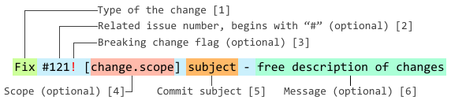

# @kazanexpress/frontend-commitlint

> A commit linter for projects of KazanExpress frontend division


## Linter installation

### Environment requirements

Check if your current environment adheres to these specs:
- `NodeJS` version >= 8.0.0 installed in your bash environment.
- `git` version >= 2.9.
- Your operating system can execute bash scripts.

### Installation

To add the linter to your current project, just execute the following commands in your project's root directory:
```bash
npm i -D @kazanexpress/frontend-commitlint
```


## About

This repository consists of two main things:
1. A comprehensive description of rules for commit conventions at [KazanExpress/FrontEnd](https://github.com/orgs/KazanExpress/teams/frontend).
   - See the [`Commit formatting`](#commit-formatting) section for more info.
2. Commit linter for NodeJS projects.
   - See the [`Linter installation`](#linter-installation) section for more info.

If there are any proposals or comments on the matter - feel free to [create an issue](https://github.com/KazanExpress/ke-frontend-commitlint/issues/new)! 😉

---

## Commit formatting

This section covers conventions for commit message formatting used at [KazanExpress/FrontEnd](https://github.com/orgs/KazanExpress/teams/frontend).

### Reasons

We found several reasons for establishing commit conventions:
- Easier change tracking.
- Visually similar commit message format.
  - Easier visual analysis of commit messages.
- Potential for automated changelog and semver updates generation.
- informativity
  1. Commits should tell WHY they were made in the first place.
  2. Commits should provide context for changes they bring.

### Format

Any commit message header (first line) must consist of following parts:



1. **Type** - the first word in the commit message.
   - Possible types:
      - `Fix` - some bug or error is fixed (preferably with an issue number, see pt. 2).
      - `Feature` - some new feature is introduced  (preferably with an issue number, see pt. 2).
      - `Add` - addition of new things in general.
         - `Add npm-package-name - v1.0.0` - example of adding a new npm package
         - `Add modules/user - intial functionality` - example of adding a new module in folder `modules`
      - `Update` - updating of things in general (package versions, for example).
      - `Chore` - routine maintenance, things that do not directly fall into any other type.
        - Choose this type if you **do not want to include** this change in the *final changelog*!
      - `Refactor` - code/structure refactoring. File renames go here too.
      - `Content` - changes to static content that do not affect functionality.
      - `Revert` - commits/changes reverts.
      - `Docs` - updates to documentation.
      - `Remove` - removal of things in general (files, functionality, etc.).
         - `Remove npm-package-name - deprecated` - example for removal of an existing npm package
         - `Remove [User.oldFunction] modules/user - I'm sick of it` - example for removal of an existing function in module `user`

2. **Related issue**, optional. Should be placed whenever changes in commit resolve or affect an issue in a certain way. If many issues are affected, choose the most relevant one and place others in commit message [6].

3. **Breaking change flag**, optional. Shows if there was a breaking change in the commit.

4. Change **scope** - a semi-complete scope of the change in a subject. Optional.

5. **Subject** of the change - usually would be a file or a folder that is subject to change in this commit.
   - Subject can be stated as `*` (as in `Add * - initial commit`) to specify that every possible subject is affected.
   - Note: **scope** ([4]) should be omitted instead of specifying it as `*`.

6. Commit **message** written in a short informal way. Should precisely describe commit's change, giving context to it.

If a commit message has a body, it should start with a preceding blank line, like this: 
```
Feature [toServer] modules/common - new method `toServer`

Convertable class can do reversed convertation from now on.
But only with a separate convert function with it's own map
```

If a commit message header (first line) is too long - informal message (`[6]`) can be omitted:
```
Feature [toServer] modules/common

Convertable class can do reversed convertation from now on.
But only with a separate convert function using it's own map.
```

### Examples:
```
Refactor rules - restructure & move to a separate folder
```
```
Fix [headerPattern] rules/pattern - spaces in commitlint headerPattern
```
```
Update * - finish initial setup
```
```
Add [LOGOUT] store/modules/user
```
```
Refactor [reset] store/modules/order

reset mutation now uses default object factory instead of hard-coding values
```
```
Remove parakeet-mapper - they fixed backend
```
```
Fix #132 [Product.constructor] types/models/product

object reference was being wrongly reassigned
```
```
Chore [tmpVer] store/plugins - bump store version
```
```
Chore [LOGOUT] store/module/* - make interconnected logouts work
```
```
Chore [rr-widget] pages/product - again updates for retail-rocket
```
---

[](https://forthebadge.com)
