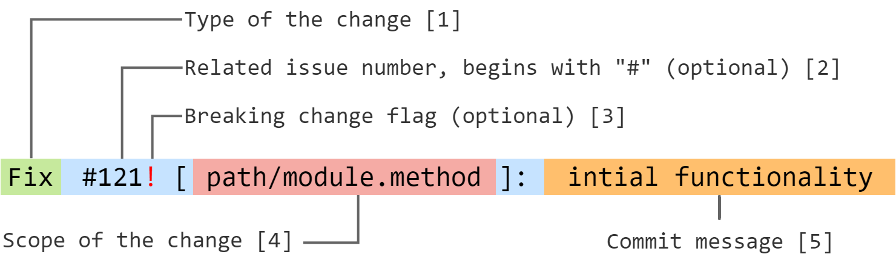

# ke-frontend-commitlint

> A commit linter for projects of KazanExpress frontend division


## About

This repository consists of two main things:
1. A comprehensive description of rules for commit conventions at [KazanExpress/FrontEnd](https://github.com/orgs/KazanExpress/teams/frontend).
   - See the [`Commit formatting`](#commit-formatting) section for more info.
2. Commit linter for NodeJS projects.
   - See the [`Linter installation`](#linter-installation) section for more info.

If there are any proposals or comments on the matter - feel free to [create an issue](https://github.com/KazanExpress/ke-frontend-commitlint/issues/new)! 😉

---

## Commit formatting

This section covers conventions for commit message formatting used at [KazanExpress/FrontEnd](https://github.com/orgs/KazanExpress/teams/frontend).

### Reasons

We found several reasons for establishing commit conventions:
- Easier change tracking.
- Visually similar commit message format.
  - Easier visual analysis of commit messages.
- Potential for automated changelog and semver generation.
- informativity
  1. Commits should tell WHY they were made in the first place.
  2. Commits should provide context for changes they bring.

### Format

Any commit message must consist of following parts:



1. Change type - the first word in the commit message.
2. Related issue, optional. Should be placed whenever changes in commit resolve or affect an issue in a certain way. If many issues are affected, choose the most relevant one and place others in commit message [5].
3. Breaking change flag, optional. Shows if there was a breaking change in the commit.
4. Change scope - a semi-complete scope of the change. Usually includes a path to the changed file or path to folder containing changed files. If a file contains a specific functionality, a method name can also be provided using dot-notation.
5. Commit message written in a short informal way. Should precisely describe commit's change, giving context to it.

### Possible change types
- `Fix` - any sort of bugfix, usually requires an issue number following it (`Fix #40`, for example)
- `Feature` - any sort of feature
- `Add` - new functionality/module/package that cannot be represented as a bugfix or a feature.
  - `Add [npm-package-name]: v1.0.0` - example for adding a new npm package
  - `Add [modules/user]: intial functionality` - example for adding a new module in folder `modules`
- `Update` - update to an existing functionality/module/package that cannot be represented as a bugfix or a feature.
  - `Update [npm-package-name]: v1.1.1` - example for updating an existing npm package
  - `Update [modules/user]: refactoring` - example for updating an existing module in folder `modules`
- `Remove` - removal of an existing functionality/module/package that cannot be represented as a bugfix or a feature.
  - `Remove [npm-package-name]: deprecated` - example for removal of an existing npm package
  - `Remove [modules/user]: I'm sick of it` - example for removal of an existing module in folder `modules`

### More examples:
```
Update [commitlint]: refactor & move to a separate folder
Fix [pattern]: fixed spaces in commitlint headerPattern
Update [commitlint]: finish initial setup
Update [store/modules/user.LOGOUT]: `order/clearContacts` was added
Add [store/modules/order.reset]: `reset` mutation was added
```

---

## Linter installation

### Environment requirements

Check if your current environment adheres to these specs:
- `NodeJS` version >= 8.0.0 installed in your bash environment.
- `git` version >= 2.9.
- Your operating system can execute bash scripts.

### Installation

To add the linter to your current project, just execute the following commands in your project's root directory:
```bash
# For git https mode
git submodule add https://github.com/KazanExpress/ke-frontend-commitlint.git .commitlint

# For git ssh mode
git submodule add git@github.com:KazanExpress/ke-frontend-commitlint.git .commitlint

npm i -D @commitlint/cli

git config core.hooksPath ./.commitlint/hooks
```


[](https://forthebadge.com)
